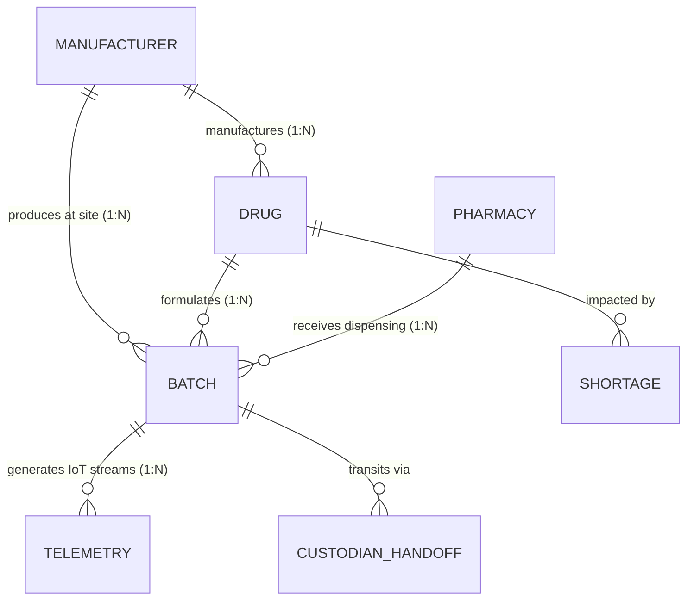

# Staged Data Dictionary & Schema Documentation

This document defines the formal data dictionary, schema contracts, source provenance, transformations, and relational mappings for all staged datasets located in `data-ingestion/staged/`.

---

## 📋 Staged File Summary

| File | Primary Key | Record Count | Source Origin | Target Polyglot Store(s) |
| :--- | :--- | :--- | :--- | :--- |
| **`drugs.json`** | `drug_id` (`DRUG-{product_ndc}`) | 3,000 | openFDA NDC Directory API | MongoDB, Redis, Neo4j |
| **`manufacturers.json`** | `manufacturer_id` (`EST-XXXX`) | 100 | openFDA Labelers & Registrations | MongoDB, Neo4j |
| **`pharmacies.json`** | `pharmacy_id` (`PHARM-{npi}`) | 1,000 | CMS NPPES Registry (NPI) API | MongoDB, Neo4j |
| **`shortages.json`** | `shortage_id` (`FDA-SH-XXXX`) | 1,635 | openFDA Drug Shortages API | MongoDB, Redpanda, Redis |

---

## 1. `drugs.json` Schema

Represents standardized pharmaceutical formulations, active ingredients, regulatory approvals, and cold-chain thermal specifications.

### Field Definitions

| Field Name | Type | Nullable | Description | Example / Constraints |
| :--- | :--- | :--- | :--- | :--- |
| `drug_id` | `string` | No | Unique synthetic identifier prefixed by `DRUG-` and NDC | `"DRUG-0093-7679"` |
| `product_ndc` | `string` | No | National Drug Code 2-segment product identifier | `"0093-7679"` |
| `brand_name` | `string` | No | Commercial proprietary drug trade name | `"Etonogestrel and Ethinyl Estradiol"` |
| `generic_name` | `string` | No | Non-proprietary generic chemical name | `"Etonogestrel and Ethinyl Estradiol"` |
| `dosage_form` | `string` | No | Physical pharmaceutical form | `"TABLET"`, `"INJECTION"`, `"SOLUTION"` |
| `route` | `string` | No | Primary administration route | `"ORAL"`, `"INTRAVENOUS"`, `"SUBCUTANEOUS"` |
| `active_ingredients`| `array[object]`| No | List of constituent chemical entities with strengths | `[{"name": "ETONOGESTREL", "strength": ".12 mg/d"}]` |
| `packaging` | `array[object]`| No | List of package variants with package NDC codes | `[{"package_ndc": "0093-7679-02", "description": "..."}]` |
| `storage_condition`| `object` | No | Thermal preservation parameters and handling rules | *(See nested definition below)* |
| `requires_cold_chain`| `boolean`| No | Fast flag indicating non-ambient storage required | `true` / `false` |
| `is_biologic` | `boolean` | No | Flag for biologics / mAbs / vaccines requiring strict temp control | `true` / `false` |
| `manufacturer_id` | `string` | No | Foreign Key referencing `manufacturers.json` | `"EST-0001"` |
| `labeler_name` | `string` | No | Legal FDA registered commercial labeler | `"Teva Pharmaceuticals USA, Inc."` |
| `marketing_category`| `string`| No | FDA drug regulatory approval pathway | `"NDA"`, `"ANDA"`, `"BLA"`, `"OTC MONOGRAPH"` |
| `product_type` | `string` | No | FDA product classification | `"HUMAN PRESCRIPTION DRUG"` |
| `dea_schedule` | `string` | Yes | Controlled substance schedule classification | `"C-II"`, `"C-III"`, `"C-IV"`, or `null` |

#### Nested `storage_condition` Object

| Field | Type | Description | Values / Range |
| :--- | :--- | :--- | :--- |
| `temperature_category` | `string` | Thermal storage category enum | `ULTRA_COLD` (-80°C to -60°C) `FROZEN` (-25°C to -10°C) `REFRIGERATED` (2°C to 8°C) `CONTROLLED_ROOM_TEMP` (15°C to 25°C) |
| `temp_range_desc` | `string` | Human-readable temperature label | `"Refrigerated (2°C to 8°C)"` |
| `min_temp_celsius` | `float` | Minimum allowable temperature threshold | e.g. `2.0`, `-80.0`, `15.0` |
| `max_temp_celsius` | `float` | Maximum allowable temperature threshold (excursion point) | e.g. `8.0`, `-60.0`, `25.0` |
| `humidity_max_percent` | `float` | Maximum allowable relative humidity threshold | e.g. `60.0` (%) |
| `requires_cold_chain` | `boolean` | Redundant boolean for query indexing | `true` / `false` |

### Transformations Applied
- **Cold-Chain Rule Engine**: Extracted text keywords from active ingredients, dosage forms, routes, and brand names to classify drugs into 4 standardized thermal stability tiers.
- **Foreign Key Binding**: Bound each drug to a valid registered manufacturer facility `manufacturer_id`.

---

## 2. `manufacturers.json` Schema

Represents FDA registered pharmaceutical manufacturing sites, synthesis plants, packagers, and primary distribution centers.

### Field Definitions

| Field Name | Type | Nullable | Description | Example / Constraints |
| :--- | :--- | :--- | :--- | :--- |
| `manufacturer_id` | `string` | No | Primary Key formatted as `EST-XXXX` | `"EST-0001"` |
| `fei_number` | `string` | No | FDA Establishment Identifier (10-digit) | `"3000010000"` |
| `duns_number` | `string` | No | Dun & Bradstreet universal numbering identifier | `"100000000"` |
| `name` | `string` | No | Legal registered corporate / facility name | `"Hahnemann Laboratories, INC."` |
| `business_operations`| `array[string]`| No | Registered manufacturing operations | `["MANUFACTURE", "PACKAGING", "LABELING"]` |
| `facility_address` | `string` | No | Physical street address | `"100 Pharmaceutical Blvd"` |
| `city` | `string` | No | City of manufacturing facility | `"Cambridge"` |
| `state` | `string` | No | State / Region code | `"MA"` |
| `country` | `string` | No | Country code (ISO 3166-1 alpha-3) | `"USA"` |
| `latitude` | `float` | No | Geographic latitude for supply chain routing | `42.3736` |
| `longitude` | `float` | No | Geographic longitude for supply chain routing | `-71.1097` |
| `gmp_compliance_status`| `string`| No | Current FDA Good Manufacturing Practice audit status | `"COMPLIANT"`, `"WARNING_LETTER"`, `"UNDER_REVIEW"` |
| `registered_product_count`| `integer`| No | Number of active NDC products produced at site | `4403` |

### Transformations Applied
- Standardized geocoding clustered around major global biotech and pharmaceutical manufacturing corridors (Boston/Cambridge, South San Francisco, Research Triangle, Basel, Dublin, Hyderabad, etc.).

---

## 3. `pharmacies.json` Schema

Represents licensed healthcare provider dispensing endpoints, hospital central pharmacies, compounding sites, and retail pharmacy chains.

### Field Definitions

| Field Name | Type | Nullable | Description | Example / Constraints |
| :--- | :--- | :--- | :--- | :--- |
| `pharmacy_id` | `string` | No | Primary Key formatted as `PHARM-{npi}` | `"PHARM-1649791633"` |
| `npi` | `string` | No | CMS National Provider Identifier (10-digit) | `"1649791633"` |
| `name` | `string` | No | Legal organization or dispensary trading name | `"10TH AVENUE PHARMACY"` |
| `pharmacy_type` | `string` | No | CMS taxonomy description | `"Community/Retail Pharmacy"`, `"Hospital Pharmacy"` |
| `taxonomy_code` | `string` | No | Healthcare Provider Taxonomy Code | `"333600000X"`, `"3336C0003X"`, `"3336H0001X"` |
| `address` | `string` | No | Practice location street address | `"2706 W MARTIN LUTHER KING JR BLVD"` |
| `city` | `string` | No | Municipality | `"LOS ANGELES"` |
| `state` | `string` | No | US State code | `"CA"` |
| `postal_code` | `string` | No | 5-digit ZIP code | `"90008"` |
| `telephone` | `string` | Yes | Business contact telephone number | `"323-298-7693"` |
| `latitude` | `float` | No | Latitude for transit route destination calculations | `36.2783` |
| `longitude` | `float` | No | Longitude for transit route destination calculations | `-119.9179` |
| `has_cold_storage` | `boolean` | No | Indicates verified 2°C–8°C refrigerated capacity | `true` / `false` |
| `has_ultra_cold_freezer`| `boolean`| No | Indicates ultra-cold (-80°C) freezer infrastructure | `true` / `false` |

### Transformations Applied
- Extracted primary practice location and phone from multi-address CMS NPPES responses.
- Inferred cold-storage facility capabilities based on hospital vs. retail taxonomy designations.

---

## 4. `shortages.json` Schema

Represents verified FDA national drug shortages, supply bottlenecks, manufacturing disruptions, and clinical alternative recommendations.

### Field Definitions

| Field Name | Type | Nullable | Description | Example / Constraints |
| :--- | :--- | :--- | :--- | :--- |
| `shortage_id` | `string` | No | Unique shortage report identifier | `"FDA-SH-0001"` |
| `generic_name` | `string` | No | Affected generic drug ingredient | `"Promethazine Hydrochloride Injection"` |
| `brand_name` | `string` | No | Commercial brand name associated with shortage | `"Promethazine Hydrochloride Injection"` |
| `therapeutic_category` | `array[string]`| No | Clinical therapeutic application classifications | `["Analgesia/Addiction", "Gastroenterology"]` |
| `status` | `string` | No | Disruption lifecycle state | `"CURRENT"`, `"RESOLVED"` |
| `reason` | `string` | No | FDA declared root cause for shortage | `"Manufacturing and supply chain constraint"` |
| `date_reported` | `string` | No | Initial public shortage notice date (`MM/DD/YYYY` or ISO) | `"11/21/2023"` |
| `date_resolved` | `string` | Yes | Date shortage was officially declared resolved | `"08/13/2026"` or `null` |
| `update_date` | `string` | No | Last update from FDA supply chain taskforce | `"08/13/2026"` |
| `company_name` | `string` | No | Primary manufacturer reporting the shortage | `"Hikma Pharmaceuticals USA, Inc."` |
| `affected_dosage_form` | `string` | No | Specific formulation impacted | `"Injection"`, `"Oral Suspension"` |
| `alternative_treatments` | `string` | No | Therapeutic substitutions and clinical guidelines | `"Consult Clinical Formulary"` |
| `disruption_severity_score`| `float` | No | Calibrated risk multiplier (1.0 to 5.0) | `3.5` |

### Transformations Applied
- Retained 100% of all 1,635 historical records from openFDA.
- Computed calibrated `disruption_severity_score` based on GMP compliance triggers, API scarcity, active status, and alternative availability.

---

## 🔗 Relational & Polyglot Storage Mapping

| Database Engine | Primary Entities Stored | Key Access Pattern |
| :--- | :--- | :--- |
| **MongoDB** (`mongo:7`) | Full documents: `drugs`, `manufacturers`, `pharmacies`, `shortages`, `batches` | Flexible schema lookups, batch compliance records, full-text ingredient search |
| **Neo4j** (`neo4j:5`) | Nodes: `(:Manufacturer)`, `(:Drug)`, `(:Pharmacy)`, `(:Batch)` Edges: `[:PRODUCED_BY]`, `[:SHIPPED_TO]`, `[:HANDED_OFF_TO]` | Graph traversals, supply chain bottleneck discovery, multi-tier provenance & anti-counterfeiting lineage |
| **Cassandra** (`cassandra:5`) | Time-series partitions: `telemetry_by_batch` (`batch_id`, `timestamp`, `temp_celsius`, `humidity`, `gps_lat`, `gps_lon`) | High-throughput sensor writes, time-window aggregations |
| **Redis** (`redis:7-alpine`) | Key-value & Hashes: `batch:{id}:status`, `drug:{ndc}:temp_spec` | Sub-millisecond current location lookups, live cold-chain status, alert state |
| **Redpanda** (`v24.1.8`) | Topics: `iot-telemetry-raw`, `supply-chain-events`, `shortage-alerts` | High-frequency IoT stream ingestion, event publication |

